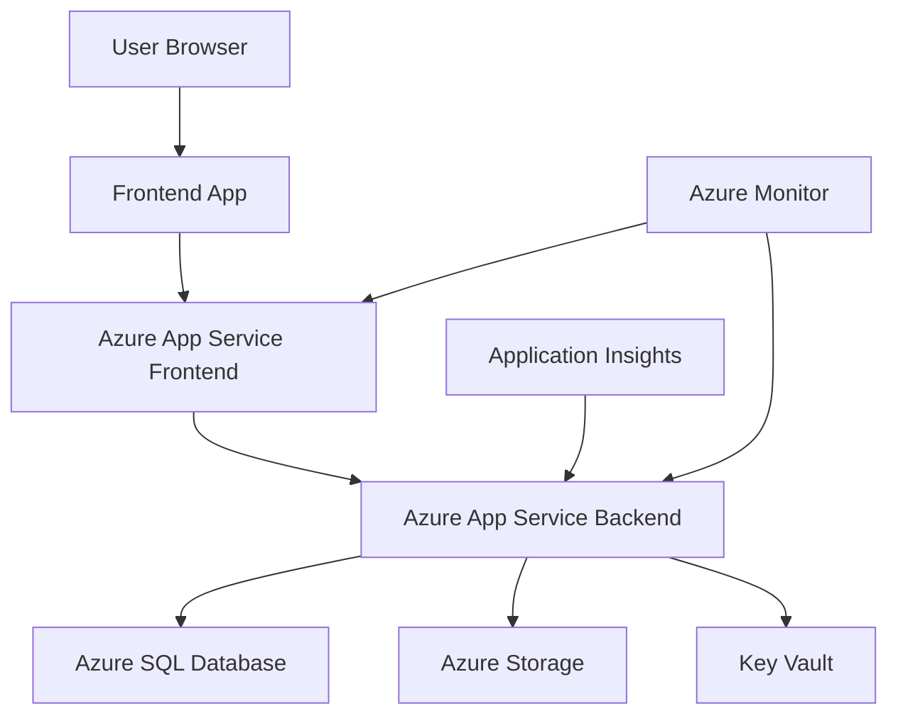

# Architettura del Sistema Edoras

## Panoramica

Edoras è un'applicazione full-stack progettata con un'architettura moderna a microservizi, deployabile su Azure Cloud Platform.

## Principi Architetturali

### 1. Separation of Concerns
- **Frontend**: Responsabile dell'interfaccia utente e UX
- **Backend**: Gestisce business logic, API e accesso ai dati
- **Database**: Persistenza dati e integrità referenziale
- **Storage**: File statici, immagini, documenti

### 2. Scalabilità
- App Services Azure con auto-scaling
- Database con connection pooling
- CDN per contenuti statici
- Load balancing automatico

### 3. Sicurezza
- HTTPS/TLS ovunque
- Key Vault per segreti
- JWT per autenticazione
- CORS configurato
- Input validation e sanitization

### 4. Monitoraggio
- Application Insights per telemetria
- Logging strutturato
- Health checks
- Performance monitoring

## Componenti del Sistema

### Frontend

```
frontend/
├── src/
│   ├── components/          # Componenti UI riutilizzabili
│   │   ├── common/         # Button, Input, Modal, ecc.
│   │   └── layout/         # Header, Footer, Sidebar
│   ├── pages/              # Pagine principali dell'app
│   ├── services/           # API client e HTTP calls
│   ├── hooks/              # Custom React hooks
│   ├── utils/              # Helper functions
│   └── assets/             # Stili, immagini, font
```

**Responsabilità:**
- Rendering interfaccia utente
- Gestione stato applicazione
- Chiamate API al backend
- Routing e navigazione
- Validazione input lato client

### Backend

```
backend/
├── src/
│   ├── api/                # Layer API
│   │   ├── controllers/    # Request handlers
│   │   ├── routes/         # Route definitions
│   │   └── middleware/     # Auth, logging, validation
│   ├── models/             # Data models e schema
│   ├── services/           # Business logic
│   ├── utils/              # Helper functions
│   └── config/             # Configurazioni app
```

**Responsabilità:**
- API REST/GraphQL
- Business logic
- Autenticazione e autorizzazione
- Validazione dati
- Comunicazione database
- Gestione file e storage

### Database

**Azure SQL Database** come database principale:
- Transazioni ACID
- Relazioni tra entità
- Stored procedures per logica complessa
- Backup automatici
- Encryption at rest

**Possibili alternative:**
- PostgreSQL (Azure Database for PostgreSQL)
- MongoDB (Azure CosmosDB)
- Redis (Azure Cache for Redis) per caching

### Storage

**Azure Storage Account:**
- **Blob Storage**: File, immagini, documenti
- **File Storage**: File condivisi
- **Queue Storage**: Messaging asincrono
- **Table Storage**: NoSQL semplice

## Flusso dei Dati



### 1. Request Flow
1. Utente interagisce con frontend
2. Frontend valida input e chiama API
3. Backend riceve richiesta e valida
4. Business logic processa i dati
5. Database query/update se necessario
6. Response ritorna al frontend
7. Frontend aggiorna UI

### 2. Authentication Flow
1. User login credentials
2. Backend valida contro database
3. JWT token generato e firmato
4. Token ritornato al frontend
5. Token incluso in header per richieste successive
6. Backend valida token per ogni richiesta protetta

## Pattern di Design

### 1. Repository Pattern
```
services/UserService.js
├── getUserById()
├── createUser()
├── updateUser()
└── deleteUser()
```

### 2. Controller Pattern
```
controllers/UserController.js
├── GET /api/users/:id
├── POST /api/users
├── PUT /api/users/:id
└── DELETE /api/users/:id
```

### 3. Middleware Pattern
```
middleware/
├── authentication.js      # JWT validation
├── authorization.js       # Role-based access
├── validation.js          # Input validation
├── logging.js            # Request logging
└── errorHandler.js       # Global error handling
```

## Sicurezza

### 1. Autenticazione
- JWT tokens con expiration
- Refresh token mechanism
- Password hashing (bcrypt)
- Rate limiting per login

### 2. Autorizzazione
- Role-based access control (RBAC)
- Permission-based access
- Resource-level authorization

### 3. Data Protection
- Input sanitization
- SQL injection prevention
- XSS protection
- CSRF tokens
- HTTPS only

### 4. Azure Security
- Key Vault per segreti
- Managed Identity
- Network Security Groups
- Application Gateway con WAF

## Performance

### 1. Frontend
- Code splitting
- Lazy loading
- Image optimization
- CDN per assets statici
- Browser caching

### 2. Backend
- Database indexing
- Query optimization
- Connection pooling
- Caching strategies (Redis)
- Compression

### 3. Infrastructure
- Azure Front Door per CDN globale
- Auto-scaling rules
- Load balancing
- Health checks

## Monitoring e Logging

### 1. Application Insights
- Performance metrics
- Error tracking
- User analytics
- Custom events

### 2. Logging Strategy
```javascript
// Structured logging
logger.info('User login', {
  userId: user.id,
  email: user.email,
  timestamp: new Date().toISOString(),
  userAgent: req.headers['user-agent']
});
```

### 3. Health Checks
```javascript
// Health check endpoint
GET /health
{
  status: 'healthy',
  database: 'connected',
  storage: 'accessible',
  version: '1.0.0'
}
```

## Deployment Architecture

### Azure Resources

```
Resource Group
├── App Service Plan
├── App Service (Backend)
├── App Service (Frontend)
├── SQL Server
├── SQL Database
├── Storage Account
├── Key Vault
├── Application Insights
└── Log Analytics Workspace
```

### Environment Strategy

| Environment | Purpose | Features |
|-------------|---------|----------|
| **Development** | Local development | Hot reload, debug mode |
| **Staging** | Pre-production testing | Production-like environment |
| **Production** | Live application | High availability, monitoring |

## Estensibilità

### 1. Microservizi
La struttura attuale può essere facilmente estesa a microservizi:
- Separazione per dominio (user, order, product)
- API Gateway per routing
- Service mesh per comunicazione

### 2. Event-Driven Architecture
- Azure Service Bus per messaging
- Event sourcing pattern
- CQRS per read/write separation

### 3. Containerization
- Docker containers
- Azure Container Instances
- Azure Kubernetes Service (AKS)

## Tecnologie Alternative

### Backend Options
- **Node.js**: Express, Fastify, NestJS
- **Python**: Django, FastAPI, Flask
- **.NET**: ASP.NET Core
- **Java**: Spring Boot

### Frontend Options
- **React**: Create React App, Next.js
- **Vue.js**: Vue CLI, Nuxt.js
- **Angular**: Angular CLI
- **Svelte**: SvelteKit

### Database Options
- **SQL**: Azure SQL, PostgreSQL
- **NoSQL**: CosmosDB, MongoDB
- **Cache**: Redis, Memcached

## Best Practices

### 1. Codice
- Consistent code style (ESLint, Prettier)
- Comprehensive testing
- Code reviews obbligatori
- Documentation inline

### 2. Git Workflow
- Feature branches
- Pull requests
- Semantic versioning
- Automated testing su PR

### 3. Deployment
- Infrastructure as Code (Bicep)
- Automated pipelines
- Blue-green deployments
- Rollback strategies

### 4. Monitoring
- Proactive alerting
- SLA monitoring
- Performance budgets
- Error rate thresholds

---

Questa architettura fornisce una base solida e scalabile per lo sviluppo di applicazioni moderne su Azure.
